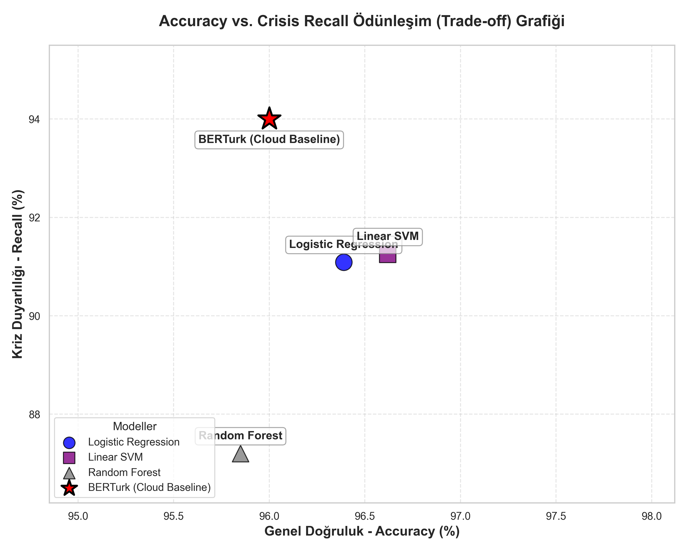
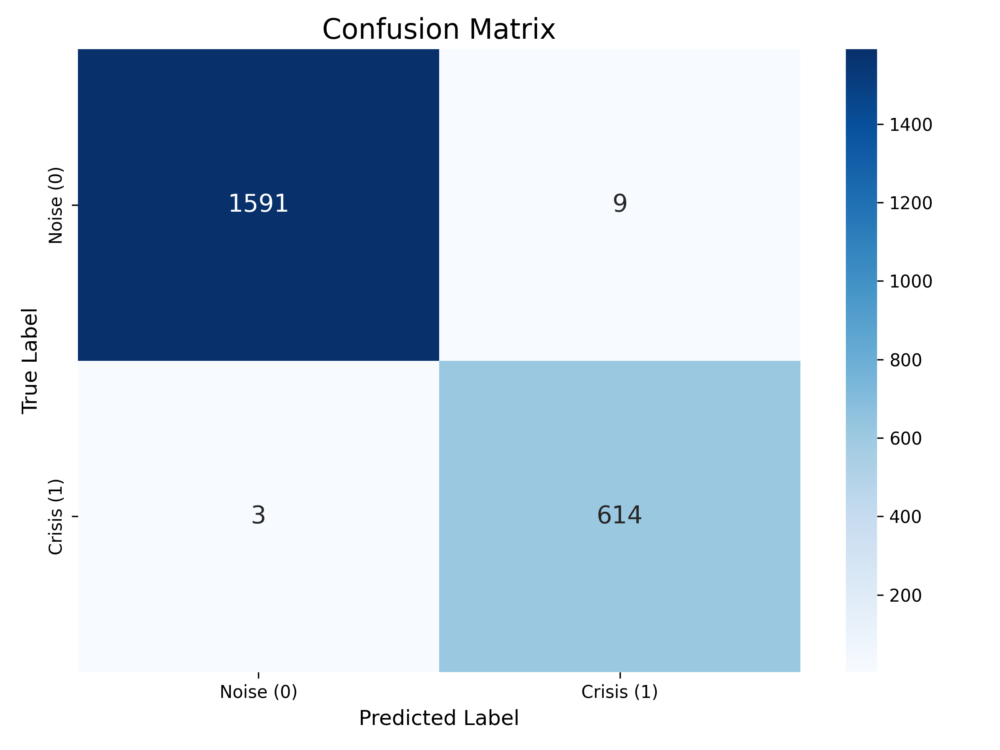
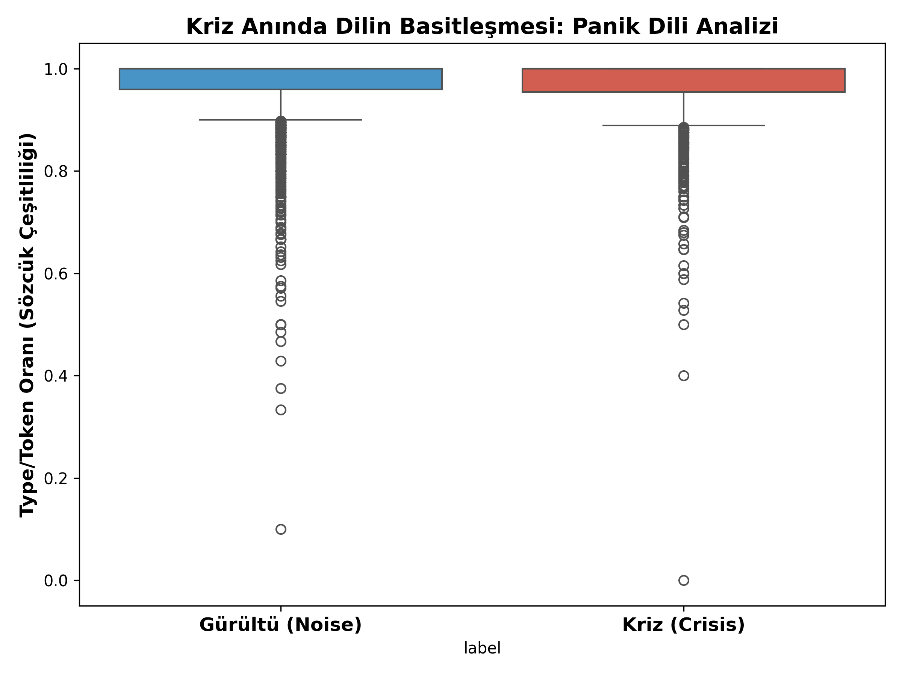
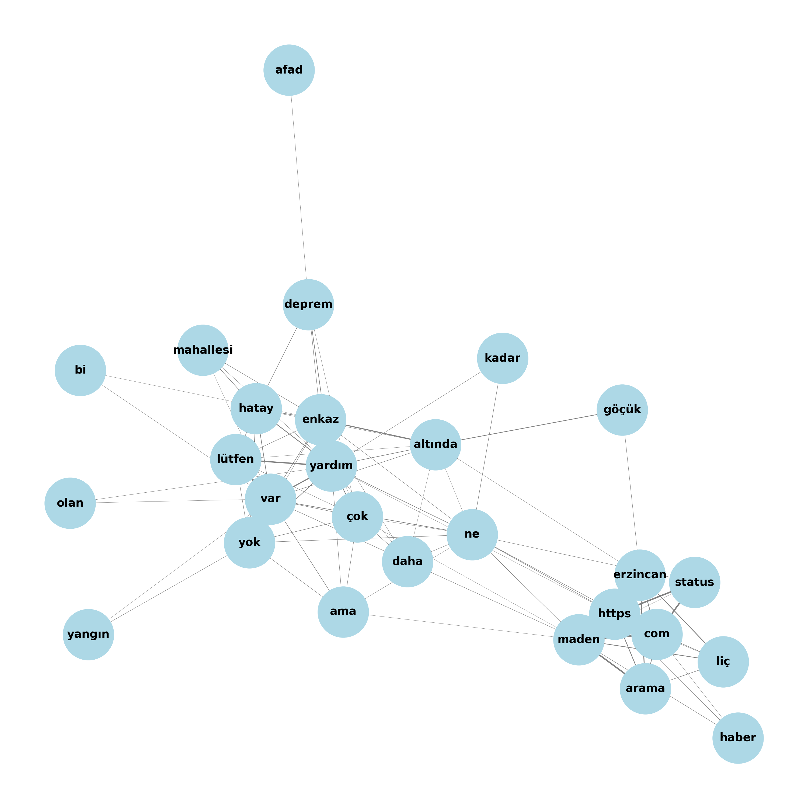

# Autonomous Location Recovery and Crisis Detection from Social Media using Morphology-Aware XAI and BERTurk


## Overview & Motivation

During natural disasters and critical events, real-time social media posts become invaluable for crisis response. However, a major challenge is **Location Deception**—where users conceal, omit, or spoof their location data for privacy or other reasons. This project introduces a state-of-the-art, autonomous text-mining pipeline designed to detect crisis-related content and recover concealed geographical locations from highly noisy, morphology-rich Turkish tweets. 

By leveraging **BERTurk** and **Morphology-Aware Explainable AI (XAI)**, our approach uncovers hidden geographic entities even when explicit metadata is absent, ensuring rapid and accurate situational awareness for emergency responders.

## Methodology

Our end-to-end framework incorporates several advanced Natural Language Processing (NLP) and Machine Learning techniques:

1. **Robust Data Processing**: 
   - Utilizes Stratified Splitting to ensure class balance across complex crisis subcategories.
   - Extensive text normalization for noisy social media data.
2. **Traditional Baseline Models**: 
   - Evaluated Linear SVM, Logistic Regression, and Random Forest models to establish robust baseline metrics.
3. **Deep Learning (BERTurk Fine-Tuning)**: 
   - Fine-tuned the Turkish BERT (BERTurk) model for highly accurate, context-aware sequence classification.
4. **Autonomous Location Recovery (NER)**: 
   - Implemented an advanced Named Entity Recognition (NER) pipeline to autonomously extract and recover location entities from unstructured text.
5. **Explainable AI (XAI)**: 
   - Integrated SHAP (SHapley Additive exPlanations) with a morphology-aware approach to demystify black-box predictions and highlight critical crisis indicators.

## Key Results

Our framework achieves state-of-the-art performance across multiple tasks:

- **BERTurk Classification**:
  - **Accuracy**: 99.46%
  - **Crisis Recall**: 99.51%
- **Baseline (Linear SVM)**:
  - **Accuracy**: 96.62%
- **Autonomous Location Recovery (NER on Noisy Texts)**:
  - **Precision**: 69.44%
  - **Recall**: 78.12%
  - **F1-Score**: 73.52%

## Visualizations

### Model Performance & Trade-offs


### BERTurk Evaluation


### Linguistic Analysis


### Semantic Network


## Project Structure

```text
├── data/                    # Dataset directory (raw & processed - ignored in Git)
├── outputs/                 
│   ├── logs/                # Training and execution logs
│   ├── plots/               # Generated visualizations and academic plots
│   ├── reports/             # Markdown and CSV reports
│   └── results/             # Saved model predictions
├── src/
│   ├── analysis/            # Scripts for auditing, XAI, and NER evaluation
│   ├── models/              # Model training, baseline tuning, and HPO
│   └── pipeline/            # End-to-end execution pipelines
├── .gitignore               # Security & data exclusion configuration
├── requirements.txt         # Python dependencies
└── README.md                # Project documentation
```

## Installation & Usage

### 1. Clone the Repository
```bash
git clone <YOUR_GITHUB_REPO_URL>
cd ML-Project
```

### 2. Set Up a Virtual Environment
```bash
python -m venv venv
# On Windows:
venv\Scripts\activate
# On Linux/Mac:
source venv/bin/activate
```

### 3. Install Dependencies
```bash
pip install -r requirements.txt
```

### 4. Run the Pipeline
To execute the end-to-end training and evaluation pipeline:
```bash
python src/pipeline/final_pipeline.py
```

To run advanced academic analyses and generate plots:
```bash
python src/analysis/academic_analyses_master.py
```

## License
This project is licensed under the MIT License. See the LICENSE file for details.
